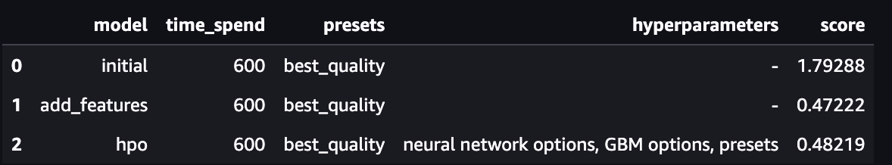
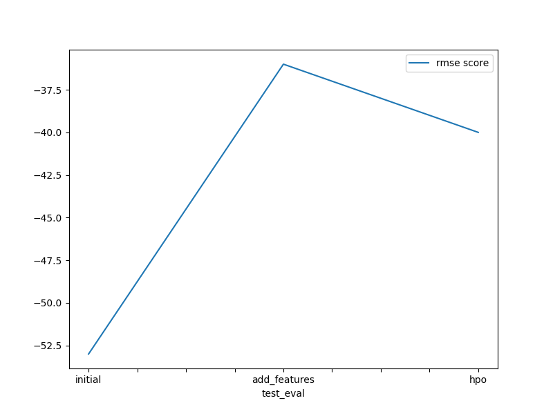
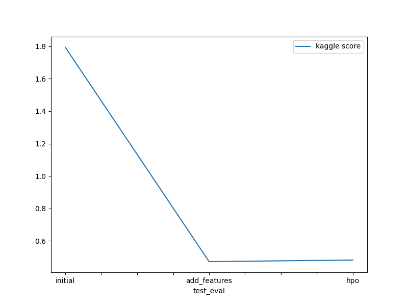

# Report: Predict Bike Sharing Demand with AutoGluon Solution
#### NAME HERE

## Initial Training
### What did you realize when you tried to submit your predictions? What changes were needed to the output of the predictor to submit your results?
Performed three runs in this experiment. The first run represented the initial case, using default hyperparameters. The second run was similar to the previous one, but with additional features. Finally, the third run involved hyperparameter tuning. To comply with Kaggle's requirements, any negative values were converted to zero since Kaggle does not accept negative values. However, it's worth noting that all three runs produced positive predictions.

### What was the top ranked model that performed?
Model performance was highest with just introducing additional features with the best kaggle score of 0.48752.

## Exploratory data analysis and feature creation
### What did the exploratory analysis find and how did you add additional features?
Following EDA and feature creation carried out:
-> Feature datetime parsed as a datetime
-> season and weather features data types are transformed into category data type.
-> New features i.e., year, month, day and hour were extracted from the datetime feature.
-> casual and registered are excluded

### How much better did your model preform after adding additional features and why do you think that is?
With the addition of additional features the model performance is improved by 32%

## Hyper parameter tuning
### How much better did your model preform after trying different hyper parameters?
No significant difference is observed with the tuning the hyper parameters.

### If you were given more time with this dataset, where do you think you would spend more time?
I would spend more time on EDA and hyper parameter tuning

### Create a table with the models you ran, the hyperparameters modified, and the kaggle score.

### Create a line plot showing the top model score for the three (or more) training runs during the project.

### Create a line plot showing the top kaggle score for the three (or more) prediction submissions during the project.

## Summary
An automated machine learning framework i.e., Autogluon is used to predict bike rental demand. Autogluon simplifies the process by automatically handling model selection, hyperparameter tuning, and feature engineering.

In this project, Autogluon is utilized to analyze historical data on bike rentals, including factors like weather conditions, time of day, and day of the week. By training on this data, Autogluon builds a model capable of predicting future bike rental demand accurately.

The benefits of using Autogluon in this context are numerous. It automates the tedious and time-consuming tasks of model selection and hyperparameter tuning, saving valuable time and effort. Additionally, Autogluon's ability to perform feature engineering automatically enhances the model's predictive capabilities.
